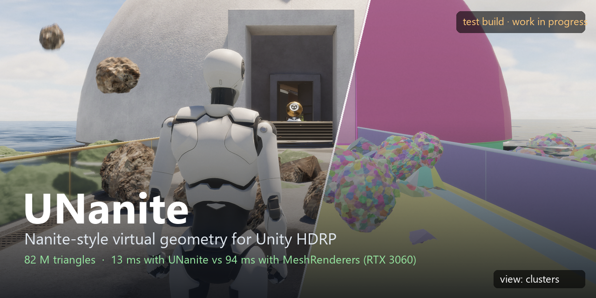
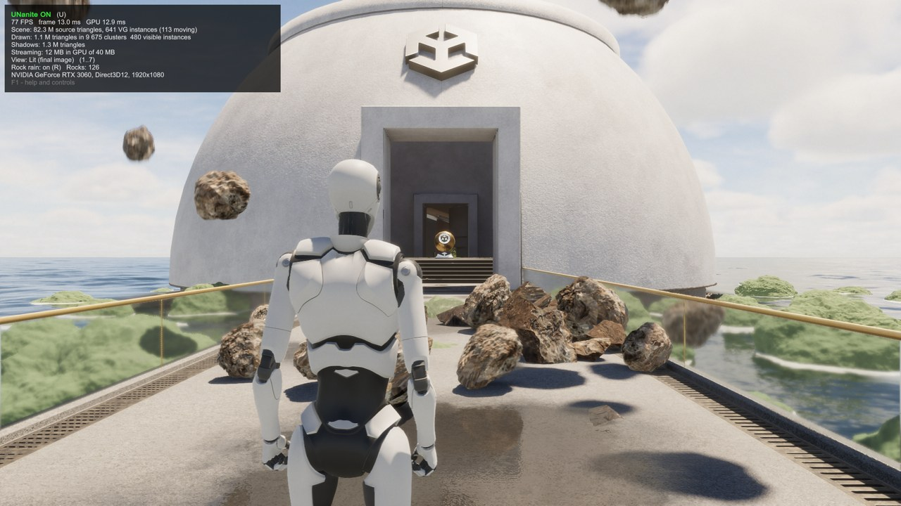
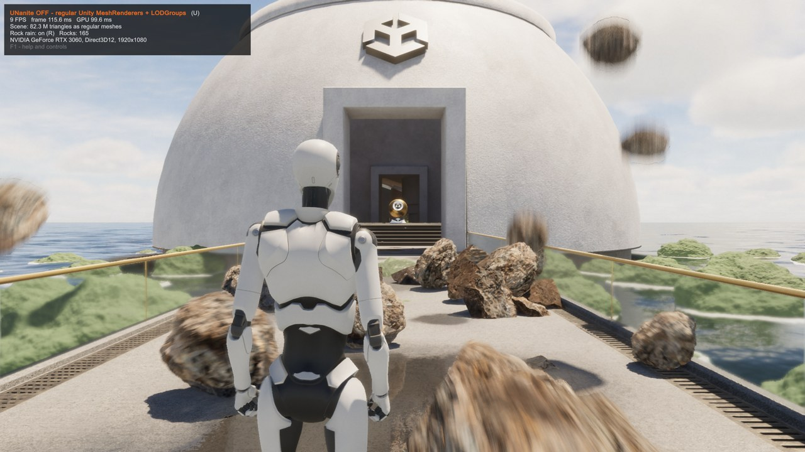
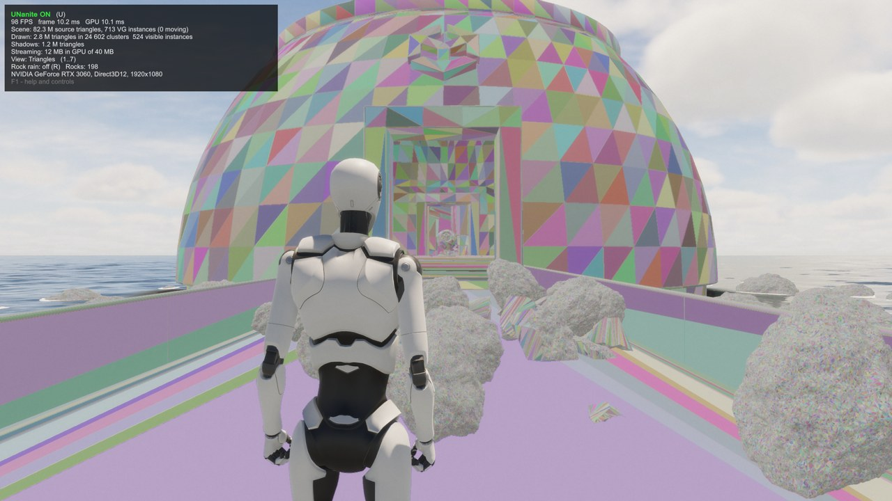
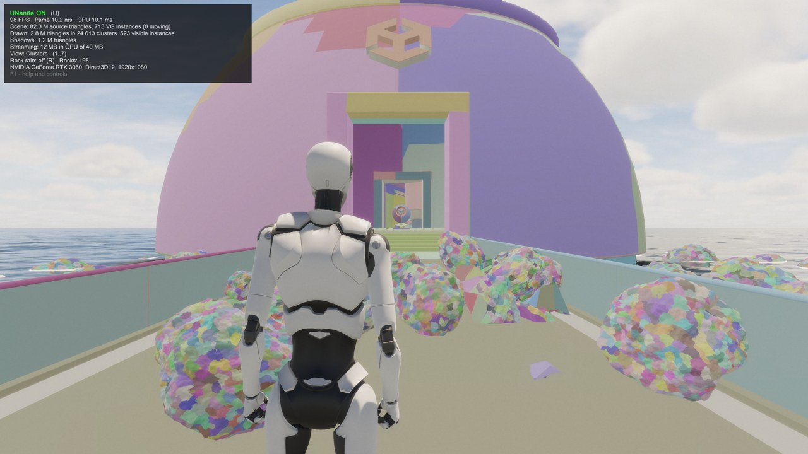
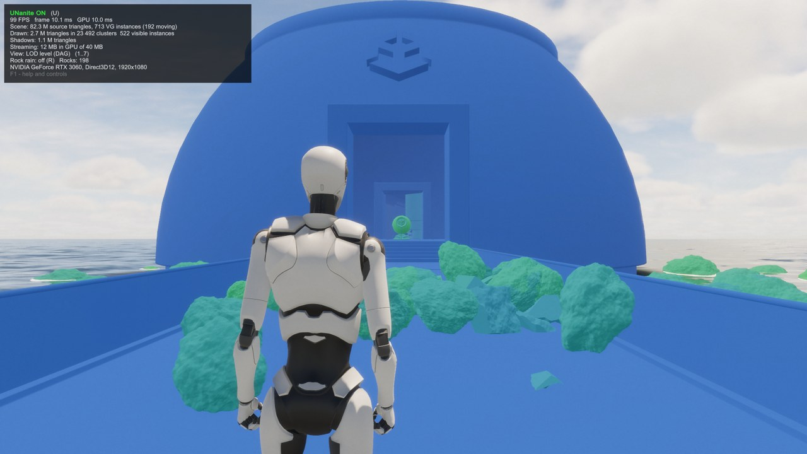

# UNanite Demo - Nanite-style virtual geometry for Unity HDRP

> **This is a test build, not a finished product.** UNanite is still work in progress, it is not stable and some things
> can break. But it is already available for download, so you can try the demo and the plugin in your own project.

Hi! UNanite is a virtual geometry system for Unity HDRP, it works similar to Nanite in Unreal Engine: every mesh is
split into small clusters of triangles with an automatic LOD hierarchy, the GPU decides every frame which clusters are
visible and how detailed they must be, and draws them through a visibility buffer. You don't need to make LODs by hand
and the number of triangles in the scene almost don't matter for the frame time.

This repository is the **demo project**: the HDRP sample scene where everything opaque is virtual geometry, plus
100 rocks with 0.3 - 1.3 million triangles each (82 million triangles in total), rocks falling from the sky and
boulders that break into pieces. You walk with the character and can turn UNanite off with one key to compare with
regular Unity rendering.

## Download

Everything is on the [Releases](https://github.com/anomal3/UNanite-Demo/releases) page:

| File | What it is |
|---|---|
| `UNaniteDemo_Windows.zip` | Ready Windows build, no Unity needed. Unzip and run `UNaniteDemo.exe` |
| `UNanite_0.11.2-preview.unitypackage` | Only the plugin, without scenes. Import it into your HDRP project |
| `UNanite_0.11.2-preview.pdf` | Plugin description and manual |
| `UNaniteDemo_Scene.unitypackage` | Only the demo scene with its assets (import after the plugin) |

Or clone this repository and open it with **Unity 6000.4.4f1** (the plugin is already inside, in `Assets/UNanite`).
Open `Assets/UNaniteDemo/UNaniteDemo.unity` and press Play. First import builds the virtual geometry of the rocks,
it takes a couple of minutes.

## Results

RTX 3060, 1920x1080, HDRP quality High, measured in the Windows build:

| | UNanite | Unity MeshRenderers |
|---|---|---|
| Scene without rock rain | **12.9 ms** (77 FPS) | 94 ms (11 FPS) |
| Rock rain + breaking boulders | **13.1 ms** | 124 ms |

To be honest: the rocks don't have hand made LODs, this is exactly the case where virtual geometry help the most.
In scenes that already have good LODs the difference is much smaller.

| UNanite | Unity MeshRenderers |
|---|---|
|  |  |

| Triangles | Clusters | LOD level |
|---|---|---|
|  |  |  |

## Controls (also in the build)

| Key | Action |
|---|---|
| WASD / mouse | walk and look, Shift - run, Space - jump |
| **U** | UNanite on / off (same scene with regular MeshRenderers and their LODGroups) |
| **1..7** | view: lit, triangles, clusters, cluster groups, LOD level, instances, materials |
| **R** | rain of rocks on / off |
| **B** | drop a boulder, it breaks into pieces |
| **C** | clear the rocks |
| F2 | stats, F1 / Esc - help window, F10 - quit |

## What is working

- Conversion of MeshRenderers (and LOD0 of LODGroups) to virtual geometry with one menu command
- Cluster DAG with automatic LOD, GPU culling with two-pass occlusion, visibility buffer, software raster for tiny triangles
- HDRP/Lit and most Lit Shader Graphs, transparent parts of mixed objects
- Shadows, baked lightmaps, motion vectors, ray tracing proxies
- Page streaming (only the detail you see stay in GPU memory) and compressed geometry
- Terrain, SpeedTree trees and grass with wind
- Destruction: the mesh is fractured on import, every piece is also virtual geometry
- Player builds on Windows / DirectX 12

**Not yet:** skinned meshes (the character in the demo is regular Unity), URP, mobile, Vulkan and AMD cards are not
tested. I tested it only on RTX 3060, so if you will run it on other hardware please tell me how it goes.

## Plugin in your project

1. Unity 6000.4 with HDRP 17.4.
2. Import `UNanite_0.11.2-preview.unitypackage`, a welcome window will open (you can switch it off at the bottom).
3. Select objects in the scene: **Tools > UNanite > Convert Selection to Virtual Geometry**.
4. Press Play. Debug views are in the UNanite overlay of the Scene view.

More details are in the PDF on the Releases page.

## About me and the project

I am one developer and I make UNanite alone, in my free time after work. I am working on it since this summer:
first was the cluster hierarchy and GPU culling, then the visibility buffer, shadows and streaming, last month I add
terrain, foliage and destruction. Next big step is **virtual shadow maps** (cached paged shadows, like in Unreal), they
will make shadows much cheaper in big scenes. When the next version will be ready, I will post it here.

If you find a bug or have a scene where UNanite works bad, please open an issue, it helps a lot.

## Support the project

If you decide to support the project and the future of this Nanite system (virtual shadow maps are next), you can
donate USDT:

**USDT (TRC-20):** `TYdALudExGBdgWYEqiZTZ6J6kyHf39U8pq`

Thank you, every support really helps to find more time for UNanite!

## Credits

- The scene, the character and the sample assets are from Unity's HDRP 3D Sample template (Unity Companion License).
- The native cluster builder uses [meshoptimizer](https://github.com/zeux/meshoptimizer) (MIT).
