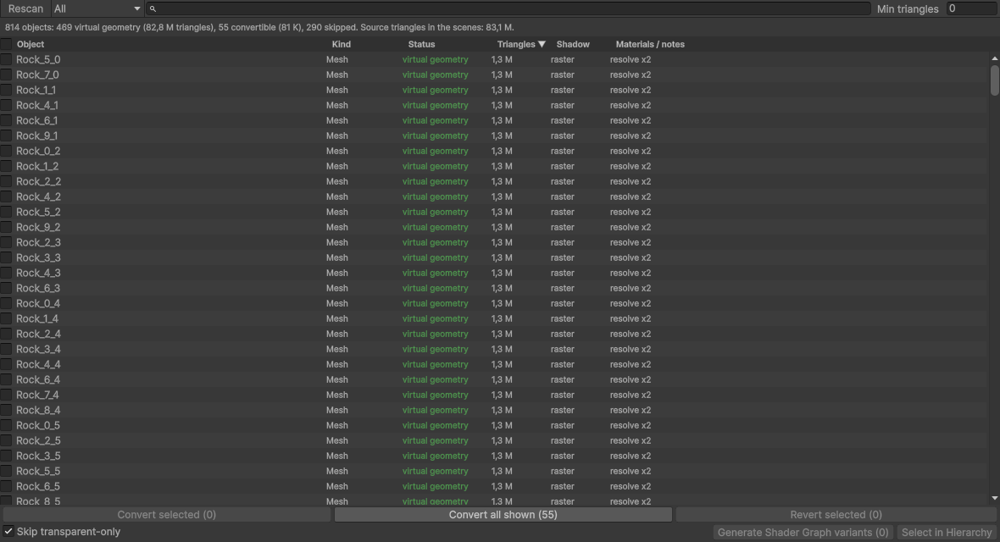
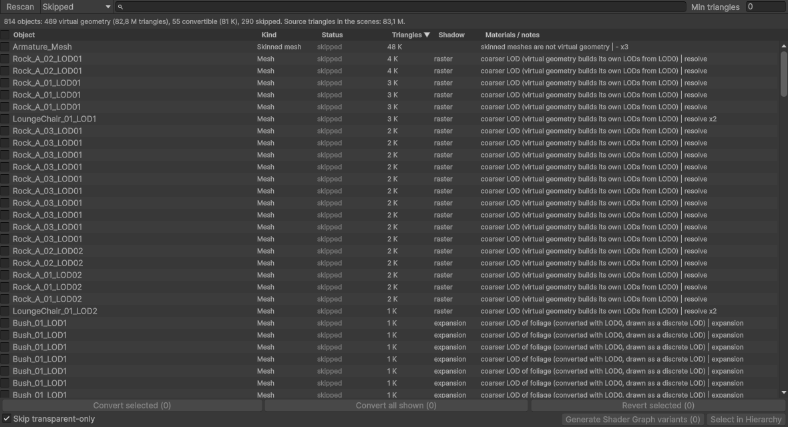
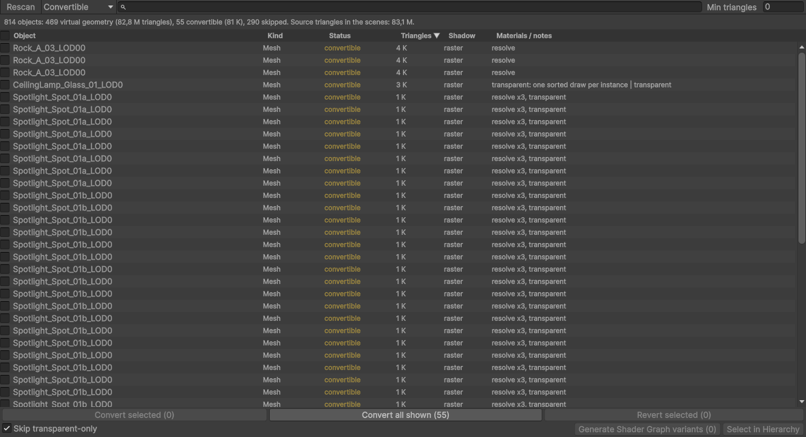
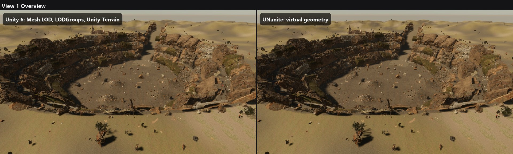
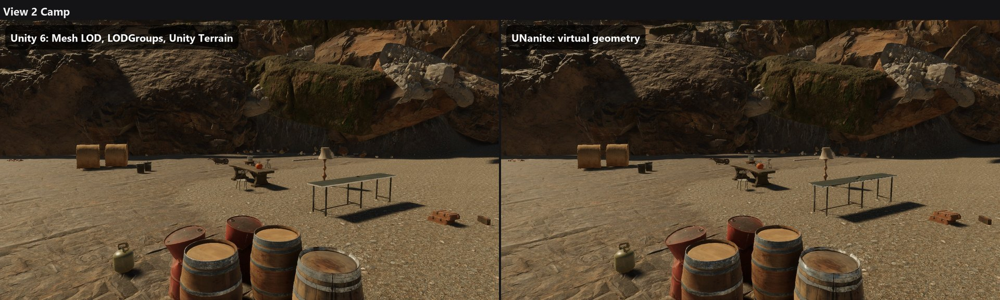

# UNanite Demo - Nanite-style virtual geometry for Unity HDRP

> **This is a test build, not a finished product.** UNanite is still work in progress, it is not stable and some things
> can break. But it is already available for download, so you can try the demo and the plugin in your own project.

Hi! UNanite is a virtual geometry system for Unity HDRP, it works similar to Nanite in Unreal Engine: every mesh is
split into small clusters of triangles with an automatic LOD hierarchy, the GPU decides every frame which clusters are
visible and how detailed they must be, and draws them through a visibility buffer. You don't need to make LODs by hand
and the number of triangles in the scene almost don't matter for the frame time.

This repository is the **demo project**: the HDRP sample scene where everything opaque is virtual geometry, plus
100 rocks with 0.3 - 1.3 million triangles each (82 million triangles in total), rocks falling from the sky and
boulders that break into pieces. You walk with the character and can turn UNanite off with one key to compare with
regular Unity rendering.

## Download

Everything is on the [Releases](https://github.com/anomal3/UNanite-Demo/releases) page:

| File | What it is |
|---|---|
| `UNaniteDemo_Windows.zip` | Ready Windows build, no Unity needed. Unzip and run `UNaniteDemo.exe` |
| `UNanite_0.11.2-preview.unitypackage` | Only the plugin, without scenes. Import it into your HDRP project |
| `UNanite_0.11.2-preview.pdf` | Plugin description and manual |
| `UNaniteDemo_Scene.unitypackage` | Only the demo scene with its assets (import after the plugin) |

The release files are still version 0.11.2-preview. The repository itself already has the plugin **0.13.2-preview**
(see "What is new" below), a new release with the build will come later.

Or clone this repository and open it with **Unity 6000.4.4f1** (the plugin is already inside, in `Assets/UNanite`).
Open `Assets/UNaniteDemo/UNaniteDemo.unity` and press Play. First import builds the virtual geometry of the rocks,
it takes a couple of minutes.

## Results

RTX 3060, 1920x1080, HDRP quality High, measured in the Windows build:

| | UNanite | Unity MeshRenderers |
|---|---|---|
| Scene without rock rain | **12.9 ms** (77 FPS) | 94 ms (11 FPS) |
| Rock rain + breaking boulders | **13.1 ms** | 124 ms |

To be honest: the rocks don't have hand made LODs, this is exactly the case where virtual geometry help the most.
In scenes that already have good LODs the difference is much smaller.

| UNanite | Unity MeshRenderers |
|---|---|
|  |  |

| Triangles | Clusters | LOD level |
|---|---|---|
|  |  |  |

## Controls (also in the build)

| Key | Action |
|---|---|
| WASD / mouse | walk and look, Shift - run, Space - jump |
| **U** | UNanite on / off (same scene with regular MeshRenderers and their LODGroups) |
| **1..7** | view: lit, triangles, clusters, cluster groups, LOD level, instances, materials |
| **R** | rain of rocks on / off |
| **B** | drop a boulder, it breaks into pieces |
| **C** | clear the rocks |
| F2 | stats, F1 / Esc - help window, F10 - quit |

## What is new in 0.13.2-preview (in the repository, not yet in the release files)

- **Scene Setup window** - **Tools > UNanite > Scene Setup**. It scans all open scenes and shows every renderer:
  is it already virtual geometry, can it be converted, or why it stay a regular Unity renderer (skinned mesh, coarser
  LOD, transparent material, mesh that is not an asset of the project...). For every object you see the triangles,
  how its shadow is drawn and which way every material goes (visibility buffer resolve, vertex expansion, Shader Graph
  variant). You select the rows you want and convert or revert exactly them, with undo. Before this window you just
  press "Convert" and hope that everything went fine.

| Skipped objects and the reason | Objects that can be converted |
|---|---|
|  |  |

- **Presets in the settings.** The UNanite settings inspector have Quality / Balanced / Performance buttons now, and
  it checks the project and tell you when something is wrong (dynamic resolution forced by the HDRP asset, a graphics
  API without the software raster, experimental options that are switched on).
- **Foliage keeps its LODs.** Bushes and plants with alpha-tested leaves was losing their leaves, because the automatic
  simplification removed whole leaf cards. Now a LODGroup with foliage is converted with all its LODs, every LOD
  without simplification, and UNanite switches them at the same distance where Unity does it (new component
  *Virtual Geometry LOD Group*).
- **Fix for Unity 6 Mesh LOD.** When a model is imported with the automatic Mesh LOD of Unity 6, UNanite built all its
  LODs on top of each other. Now it takes only LOD0.
- **Fix for terrain shadows.** Big false shadows on sunny hills of virtual geometry terrain are gone.
- **New sample: Quarry Scene** (`Assets/UNanite/Samples~/QuarryScene`, HDRP). It imports a folder of Megascans
  downloads from Fab (the zip files like you download them) and builds a big slate quarry from them: rock faces on
  the walls, scree, boulders, bushes and grass, a brick ruin, a worker camp. Press **V** to compare with Unity
  rendering, **P** for a fly-through. I make it with 57 free Fab assets: 9 246 objects and 249 million triangles.

  RTX 3060, 1920x1080, DX12, native resolution, GPU time (median):

  | View | UNanite | Unity + Mesh LOD | Unity without LOD |
  |---|---|---|---|
  | Overview | **8.1 ms** | 13.3 ms | 49.5 ms |
  | Camp | **6.8 ms** | 10.0 ms | 18.4 ms |
  | Wall and scree | **6.4 ms** | 10.3 ms | 17.6 ms |
  | Ruin | **6.2 ms** | 12.0 ms | 43.8 ms |
  | Channel | **6.6 ms** | 11.5 ms | 45.8 ms |

  Unity needs 9 000 - 25 000 draw calls for this scene, UNanite 135. The Megascans files are not in this repository
  (the Fab license don't allow to share the files itself), but the sample README lists every asset I used, so you can
  download the same free ones and build the same scene with one button.

- **Data format documentation** is here now: [Docs/DataFormat.md](Docs/DataFormat.md) - how the clusters, pages and
  the compression are stored.
- 46 of 47 editor tests pass (the ray tracing test needs a quality level with ray tracing).

## What is new in 0.13.0-preview

- **URP: basic support (experimental).** UNanite now runs in URP 17 too, but only with the simpler draw path: no
  visibility buffer, no occlusion culling and no special shadow raster, this things are HDRP only for now. I tested
  it only in one low-poly URP project, so expect problems.
- **Cheaper shadows.** Shadow casters that are completely outside of the shadow map are not drawn anymore (before
  they were drawn when HDRP makes the split culling wider, for example with ray traced shadows). In the demo scene
  the shadow pass was 0.52 ms and now is 0.38 ms, the picture is the same.
- Shadows of every camera are culled with the right camera now (before a reflection probe camera could take it).
- **Virtual shadow maps and runtime virtual texture for terrain - experimental, switched off.** I made both:
  shadows are cached in pages and only changed pages are drawn again, terrain layers are baked into a cached
  texture. They work and the picture is the same, but honestly in my test scenes they don't make the frame
  faster: UNanite shadows and terrain were already cheap, and managing the cache cost about the same as it saves.
  HDRP also rebuilds its shadow cascades every frame when the camera zoom changes, so the cache is reset often.
  You can try them in the settings (`virtualShadowMaps`, `terrainVirtualTexture`).

## What is working

- Conversion of MeshRenderers (LOD0 of LODGroups, foliage keeps all its LODs) to virtual geometry with one menu
  command or in the Scene Setup window
- Cluster DAG with automatic LOD, GPU culling with two-pass occlusion, visibility buffer, software raster for tiny triangles
- HDRP/Lit and most Lit Shader Graphs, transparent parts of mixed objects
- Shadows, baked lightmaps, motion vectors, ray tracing proxies
- Page streaming (only the detail you see stay in GPU memory) and compressed geometry
- Terrain, SpeedTree trees and grass with wind
- Destruction: the mesh is fractured on import, every piece is also virtual geometry
- Player builds on Windows / DirectX 12

**Not yet:** skinned meshes (the character in the demo is regular Unity), full URP support (only basic), mobile,
Vulkan and AMD cards are not tested. I tested it only on RTX 3060, so if you will run it on other hardware please tell me how it goes.

## Plugin in your project

1. Unity 6000.4 with HDRP 17.4.
2. Import `UNanite_0.11.2-preview.unitypackage`, a welcome window will open (you can switch it off at the bottom).
3. Open **Tools > UNanite > Scene Setup**: it shows what can be converted. Select the rows and press Convert (or
   select objects in the scene and use **Tools > UNanite > Convert Selection to Virtual Geometry**).
4. Press Play. Debug views are in the UNanite overlay of the Scene view.

More details are in the PDF on the Releases page. How the geometry data is stored (clusters, pages, compression):
[Docs/DataFormat.md](Docs/DataFormat.md).

## About me and the project

I am one developer and I make UNanite alone, in my free time after work. I am working on it since this summer:
first was the cluster hierarchy and GPU culling, then the visibility buffer, shadows and streaming, last month I add
terrain, foliage and destruction. After that I tried **virtual shadow maps** (cached paged shadows, like in Unreal).
I expected that they will make shadows much cheaper, but in my tests the gain was not there (see "What is new"), so
for now they stay an experiment. When the next version will be ready, I will post it here.

If you find a bug or have a scene where UNanite works bad, please open an issue, it helps a lot.

## Support the project

If you decide to support the project and the future of this Nanite system, you can donate USDT:

**USDT (TRC-20):** `TYdALudExGBdgWYEqiZTZ6J6kyHf39U8pq`

Thank you, every support really helps to find more time for UNanite!

## License

UNanite is free and open source: **GPL-3.0 with a Unity exception**. You can use it in any project - free or paid,
open or closed source, your own game code stays yours. What I ask in return:

- UNanite itself and every changed version of it stays open (GPL-3.0, with the source);
- keep the credit **"UNanite by Roman Koscheev (anomal3)"** in your credits or about screen;
- don't present it as your own work and don't call your own version "UNanite".

Details in [LICENSE.md](LICENSE.md) and [NOTICE.md](Assets/UNanite/NOTICE.md).

## Credits

- The scene, the character and the sample assets are from Unity's HDRP 3D Sample template (Unity Companion License),
  they are not covered by the GPL.
- The native cluster builder uses [meshoptimizer](https://github.com/zeux/meshoptimizer) (MIT).
